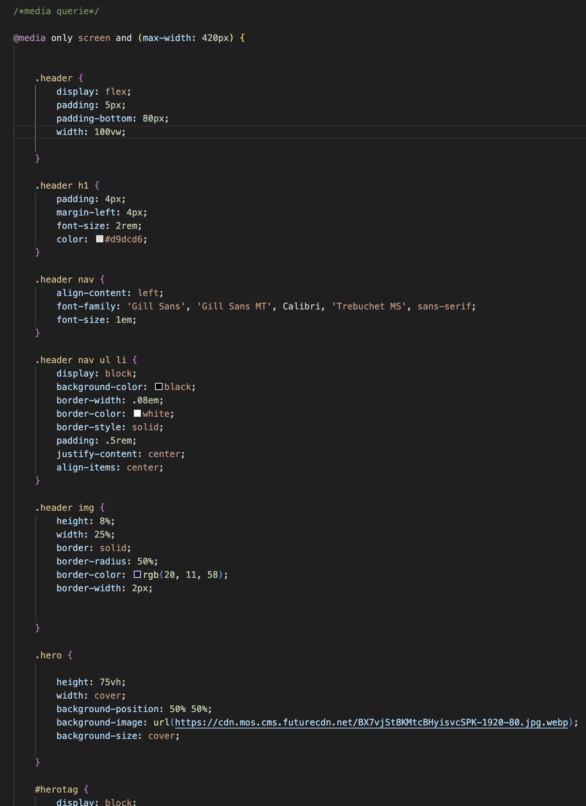
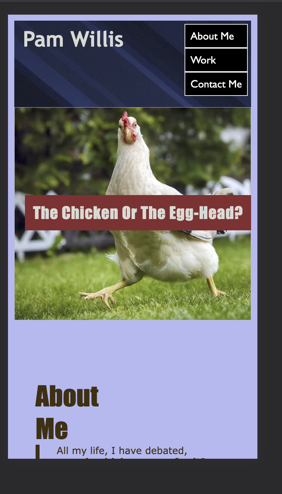
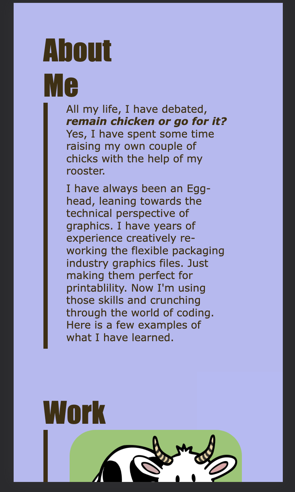
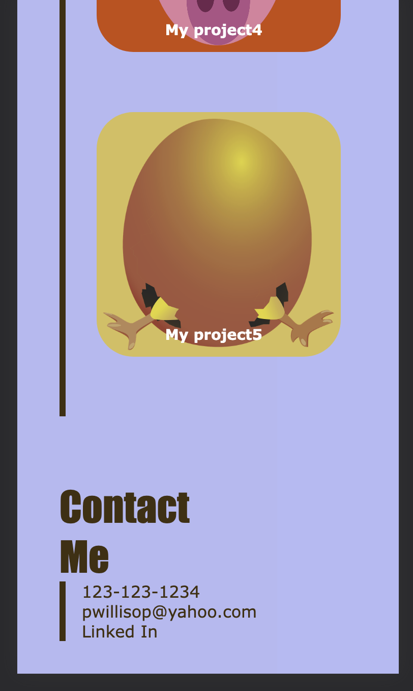

# 02_CREATING_A_PROFESSIONAL_PORTFOLIO_PAGE

- Project shows my deployed website, showing projects I have worked on.
- Coding includes usage of hover and how it can be used to highlight different areas and trigger a note to the user to click. This can be used to show user you can jump to another section of the page, or to open another page entirely.
- Alt tags allow reader to understand photos, that they may not be able to see.
- Labeling sections allows them to understand what area of the site they are on.
- A media querie has been added to adjust to mobile setting.

Snippet showing Media Queerie

## Credits
free clipart (license free) can be found on https://pixabay.com
all project icons were taken from there.

Top banner free from https://www.pexels.com/photo/a-simple-blue-background-15849321/

Chicken photo is linked in coding.

## Usage
GitHub repository can be downloaded from:
 https://github.com/PamWillis/02_Creating_A_Professional_Portfolio_Page.git

Deployed website: https://pamwillis.github.io/02_Creating_A_Professional_Portfolio_Page/

view video of how the site can be used (please note, when clicking on different projects, they are opening in seperate windows, so they did not record): https://drive.google.com/drive/folders/19thpug2NYeDX2rnoowxApjRsXM7ftW0D?usp=sharing

video of mobile site is shown here:
https://drive.google.com/file/d/1GE2b-M8UjikAbLxEdmgr6DCkV8bXX1sw/view

Snippits of website shown below:

mobile

